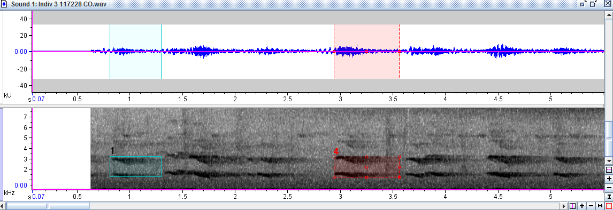

#Análisis Estadístico

El procesamiento de los datos se realizó en R studio. Donde se realizó un Kruskal-Wallis para cada métrica medida, contra los cinco países elegidos. Posteriormente se hicieron boxplot para poder observar las diferencias entre los valores de las métricas de cada país. 

#Diseño Experimental
Los cantos  de R. ambiguuss, se extrajeron de “https://www.xeno-canto.org/” , utilizando solamente los clasificados como “song”.Posteriormente en R studio se convirtieron de mp3 a wav. Luego se eligieron cinco países: Costa Rica, Panamá, Ecuador, Colombia y Venezuela. En el software Raven Pro, se analizaron los respectivos espectrogramas (Fig 4) y para cada país se analizaron 10 grabaciones correspondientes a distintos individuos y de 10- 20 tractos dependiendo de la calidad de la grabación

 Las métricas  acústicas extraídas de Raven pro, fueron las siguientes: Tiempo de inicio (s), tiempo de finalización (s),  frecuencia baja (Hz), frecuencia alta (Hz), tiempo máximo (s), energía (dB), entropía máxima (bits), máxima frecuencia (Hz),  máximo poder (dB), entropía mínima (bits), frecuencia pico (Hz) y longitud.

{width=500px} 

 

Figura 4. Espectrograma del canto de  *Ramphastos ambiguus* para el individuo 3 de Colombia

