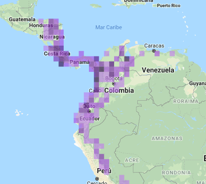
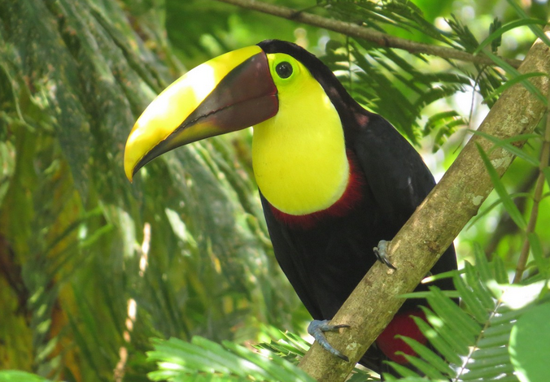
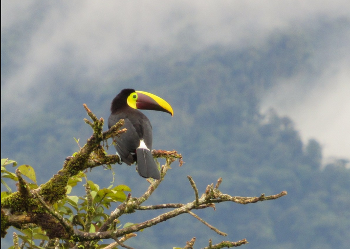

#Características de *R.ambiguss*

#Integrantes 

Laura Segura 

**Análisis del canto del tucán de pico negro (*Ramphastos ambiguus*) en cinco países del Neotrópico**

#Filogenía y distribución

Pertenece a la familia Ramphastidae y al orden Piciformes. Estos se distribuyen a lo largo del Neotrópico, algunos países son Nicaragua, Panamá y Colombia

{width=400px} 

Figura 1. Ditribución de *Ramphastos ambiguus* a lo largo del Neotropico

 
 
 
#Descripción morfológica

Pájaro conspicuo y grande con un pico sobredimensionado. Principalmente negro, con garganta y cara amarillas. Mide entre 53 y 56 cm de longitud y pesa entre 620 y 740 g. Su plumaje es principalmente negro con las puntas marrón desde la corona hasta la parte alta de la espalda; las plumas encima de la cola son de color crema; debajo de la cola de color rojo; pecho rojo. Pico de aproximadamente 18 cm de largo, un poco más corto en la hembra, con una línea negra alrededor de la base, verde viche o amarillento en el culmen haciéndose más ancho distalmente, presenta un triángulo negruzco sobre el resto de la maxila y sobre la mandíbula, a veces castaño cerca de la base. La piel de la cara es azul, verde pálido, o verde amarillento

{width=400px}

Figura 2. Fotografía tomada de Ebird 

#Ecología del tucán negro o pechigualdo

Se encuentra en parejas o pequeñas bandadas, a menudo desfilando por el dosel en búsqueda de frutas. A veces se percha muy evidentemente en la parte superior de un árbol. Prefiere áreas boscosas, pero también se puede encontrar en jardines y bordes. Su dieta es mixta, proporción principalmente frutas. También se alimenta de insectos y de algunos vertebrados como serpientes, lagartijas, pequeñas aves o mamíferos y roba huevos

{width=400px}

Figura 3. Fotografía *R.ambiguus* en el dosel tomada de Ebird 

 